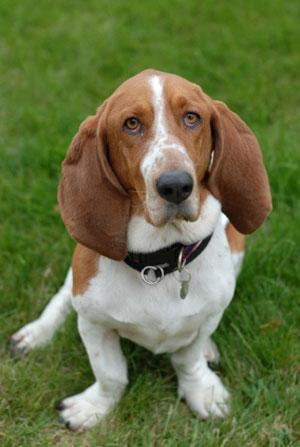
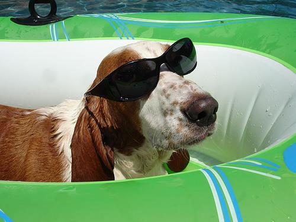
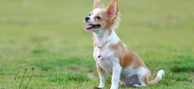
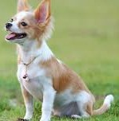
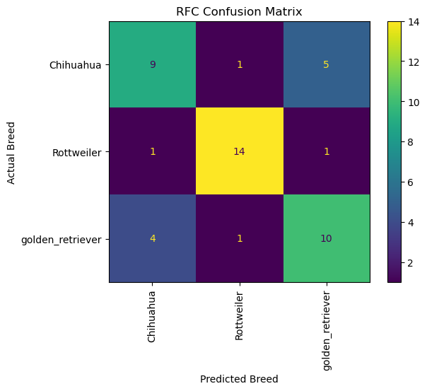
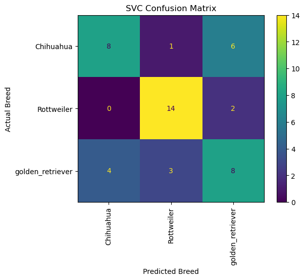
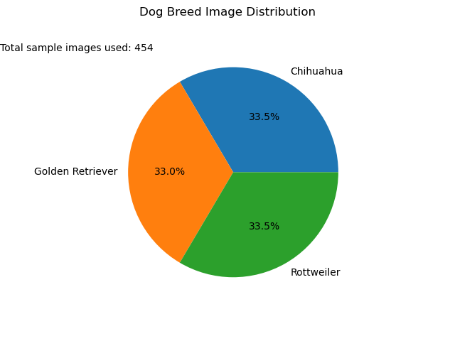
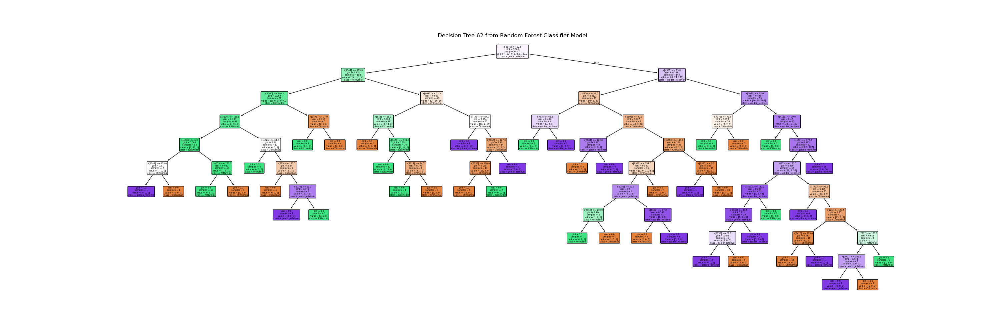

# DoggieTech Dog Image Classifier

An image classification application used to identify a dog breed.

Open the application here:

## How to use this application

This application is an interactive Jupyter Notebook where you submit an image of
a dog for breed identification. Please skip to
[Section 1](#section-1-pre-use-setup) for instructions to follow before using
the application.

If you already know how to use the application, please skip to
[Section 2](#section-2-using-the-application).

## Section 1: Pre-use Setup

These are the necessary steps to take prior when using the application:

- Take a picture of the dog.
- Crop the photo _(optional, but may help with accuracy)_.
- Upload the photo to the folder `toClassify`.
- Click the **Analyze Dog** button.

### Part A: Take a photo

Take a picture of the dog you'd like to analyze. The clearer the dog's photo,
the likelihood of the algorithm correctly identifying the dog breed increases.

Here's an example of a good photo:

<figure>

<figcaption>A clear photo of the dog showing distinct features.</figcaption>
</figure>
  
<!--  -->

Here's an example of a bad photo:

<figure>

<figcaption>The dog is obstructed by objects in the photo.</figcaption>
</figure>
  
<!--  -->

**Have a picture ready? Move onto [Part B](#part-b-crop-a-photo-optional)**

### Part B: Crop a photo (optional)

While cropping the photo is optional, it will help increase the accuracy of the
photo analysis. ([Skip this step](#section-2-using-the-application))

Here's an example of an uncropped photo:

<figure>

<figcaption>An uncropped photo of a dog and excessive background space.</figcaption>
</figure>
  

Here's an example of a cropped photo:

<figure>

<figcaption>A cropped photo focused on the dog, reduced background space.</figcaption>
</figure>
  

**Have the cropped photo ready?
([Continue to Section 2](#section-2-using-the-application))**.

## Section 2: Using the Application

### Upload a photo

Click on the button labeled **Upload** and select the photo you plan to use.
Currently, this application only accepts '.jpg', '.jpeg', and '.png'.

### Analyze the photo

Finally, we'll analyze the photo of the dog to identify its breed. Click on the
**Analyze Dog** button. You'll see the image you've selected and the predicted
breed the program has produced.

**NOTE**: Currently, the algorithm only supports 3 unique breeds:

- Rottweilers
- Golden Retrievers
- Chihuahuas

You can also try out the examples provided in the _toClassify_ folder.

## Section 3: Troubleshooting

If you're having problems uploading an image using the remote Notebook
application, refer to the [User Guide](./UserGuide.md).

## Section 4: Model Statistics

Here are the machine learning model statistics. These are dynamically updated
each time the model is trained to ensure consistency with the model and results
posted.

### Confusion Matrix

Confusion matrices tell us how the model performed during the testing phase.

- The x-axis identifies what dog breed the model predicted given an image.
- The y-axis shows the count of each breed type.

Reading from the top-left square diagonally to the bottom-right square, the
matrix identifies how many of the predictions the model made were correct. The
higher the value, the better the model accuracy.

- Ex: The model correctly predicted a picture of a chihuahua as a chihuahua.

The squares outside of the diagonal identify the amount of times the model
incorrectly predicted a breed type. The lower the value the higher the model
accuracy.

- Ex: Out of **n** images provided of the breed _chihuahua_, the model
  classified the images **k** times incorrectly as the breed _rottweiler_ or
  _golden retriever_.

This is the confusion matrix of the model when trained using a _Random Forest
Classifier_:

<figure>

<figcaption>A confusion matrix of the model trained using Random Forest</figcaption>
</figure>
  

This is the confusion matrix of the model when trained using a _Support Vector
Classifier_:

<figure>

<figcaption>A confusion matrix of the model trained using Support Vector Classifier</figcaption>
</figure>
  

### Image Distribution

The image data used to train the model is based on the
[Stanford Dogs Dataset](https://www.kaggle.com/datasets/jessicali9530/stanford-dogs-dataset).
Model training relied on numerous pictures of dogs in the following categories:

- Chihuahua
- Rottweiler
- Golden Retriever

The image distribution of the different dog breeds is similar in size. However,
the amount of sample images available was very low, and the breed within the
images varied greatly (i.e., short-haired chihuahuas and long-haired chihuahuas,
puppies and adults, fur color, etc.).

<figure>

<figcaption>A pie chart of the image distribution used by the model during training.</figcaption>
</figure>
  

### Decision Tree Model

The model had no features to use during the training and testing phase of
development. The model would classify dog breeds based on the pixel density of
images. The model would learn to identify patterns in the pictures that would
lead it to a conclusion for classifying a dog's breed. Decision trees are
created during training and help the model branch to different conclusions when
analyzing the pixel density of the images.

During testing, the random forest classifier (RFC) often outperformed the
support vector classifier (SVC), which led to the decision to use RFC for the
developed model.

This is an example decision tree used in the final version of the machine
learning model:

<figure>

<figcaption>A decision tree chosen at random for viewing the model's decisions when assessing an image.</figcaption>
</figure>
  
