# DoggieTech Dog Classifier User Guide

## Introduction

DoggieTech Dog Classifier, an application used for identifying the breed of a
dog given a photo. This classifier is trained on the
[Stanford Dogs Dataset](https://www.kaggle.com/datasets/jessicali9530/stanford-dogs-dataset),
and currently uses only three different breed categories.

This user guide discusses the files used in the application and how to interact
with the model.

**NOTE**: To access the remote application, please visit the Binder online
instance here:

> https://mybinder.org/v2/gh/GCadel/dog_breed_classification/HEAD?urlpath=%2Fdoc%2Ftree%2Fmain.ipynb

## Overview

The DoggieTech Dog Classifier uses Python and Jupyter Notebooks to download and
parse data, develop and create machine learning models, and provide an interface
for user interaction. Here is how the sections of the application are separated:

- [main.ipynb](./main.ipynb) is the user interface, where a user may upload a
  photo of a dog and retreive the machine learning model's prediction on the
  type of breed the dog is identified as.
- [dataImporting.ipynb](./dataImporting.ipynb) contains the code for downloading
  the
  [Stanford Dogs Dataset](https://www.kaggle.com/datasets/jessicali9530/stanford-dogs-dataset)
  and parsing the data for use in the machine learning algorithm. Generates the
  parsed data as [inputs_and_labels.pickle](./inputs_and_labels.pickle).
- [training.ipynb](./training.ipynb) is where the machine learning model is
  built and trained on the dataset. The final trained model is saved for use in
  [trained_models.p](./trained_models.p). This file also generates visual
  statistics about the model such as confusion matrices, image distribution,
  etc.

Important areas to look at on the webpage are highlighted in red in this guide
for quick identification.

If the application is not running on the local machine and is instead running
remotely (i.e., Binder), please follow the provided steps in the
[Remote User Instruction](#user-instructions-remote) section.

If the application is running locally, please follow the provided steps in the
[Local User Instruction](#user-instructions-local) section.

## User Instructions (Local)

### Step 1

Load the application in your Python Notebook editor of choice. For this example,
the application will be running on a Windows 11 machine with
[Anaconda](https://www.anaconda.com/download) managing the Python environment
and [Visual Studio Code](https://code.visualstudio.com/) as the interactive for
running the notebook.

### Step 2

Run all the cells in the notebook. 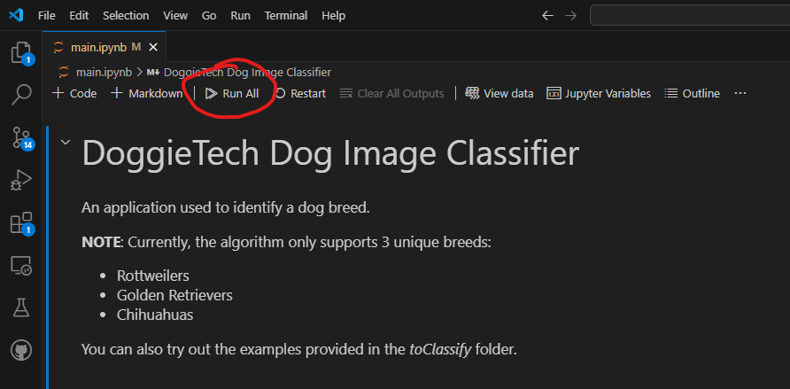

### Step 3

Scroll to the bottom of **Section 2 in the notebook**. Click the `Upload Photo`
button 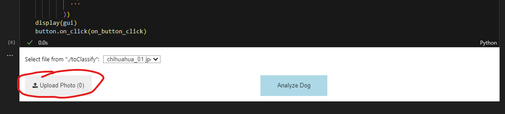

### Step 4

Choose a photo of a dog to be analyzed. 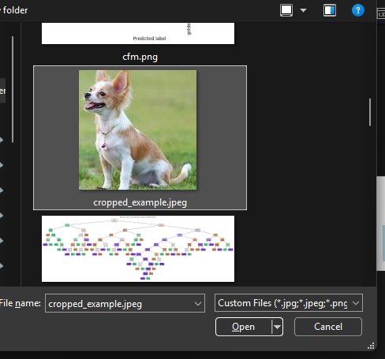

### Step 5

Click the `Analyze Dog` button. The application will display the output in a new
cell below the `Upload Photo` and `Analyze Dog` buttons.
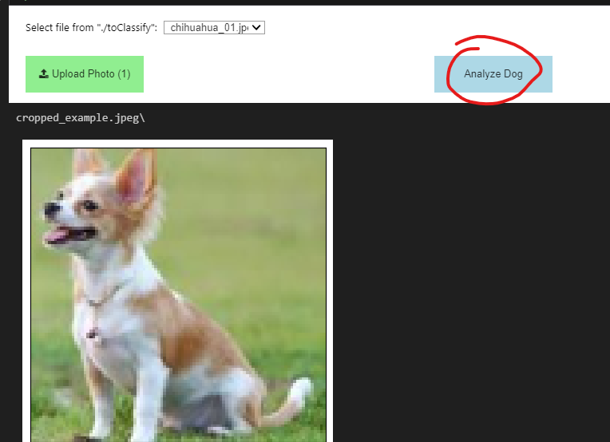

## User Instructions (Remote)

### Application access

To access the application, please visit the Binder online instance here:

> https://mybinder.org/v2/gh/GCadel/dog_breed_classification/HEAD?urlpath=%2Fdoc%2Ftree%2Fmain.ipynb

### Step 1

Locate the directory icon on the left side of the web application, then click
the icon to open the file tree.

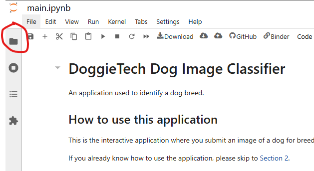

### Step 2

Double-click the folder `toClassify` to open the directory in the file tree.

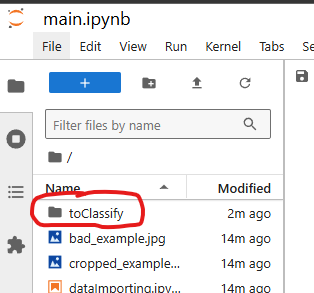

### Step 3

Drag and drop the photo of the dog to identify into the folder.

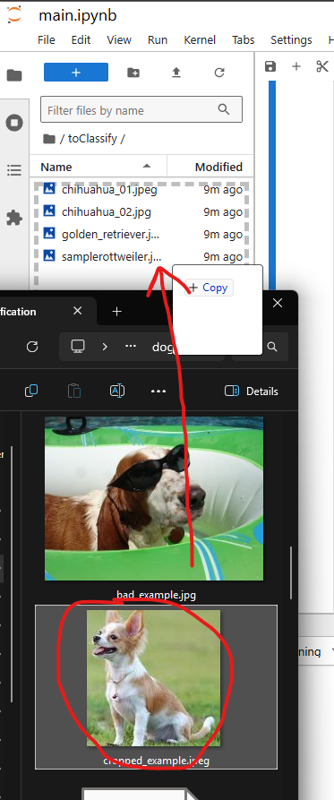

### Step 4

Verify your photo was uploaded.

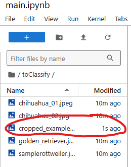

### Step 5

On the top menu bar, click `Kernel` > `Restart Kernel and Run All Cells...`

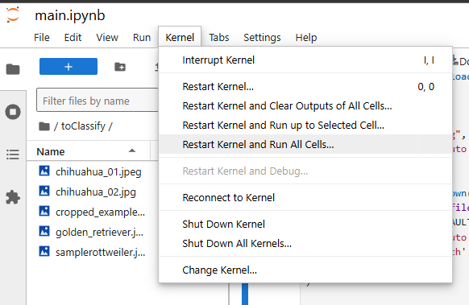

### Step 6

Click `Restart` if prompted.

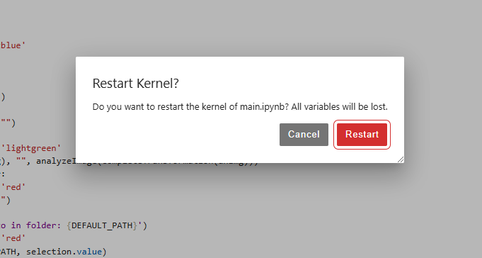

### Step 7

Scroll to the bottom of the page. After the last cell, a selection dropdown will
be present. Click on the dropdown and select the photo you've uploaded.

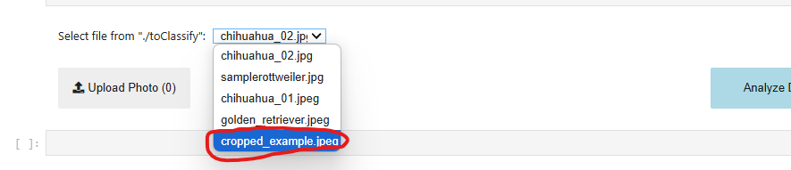

### Step 8

First, click on the `Analyze Dog` button, then click the blue **log entries**
icon at the bottom of the page.

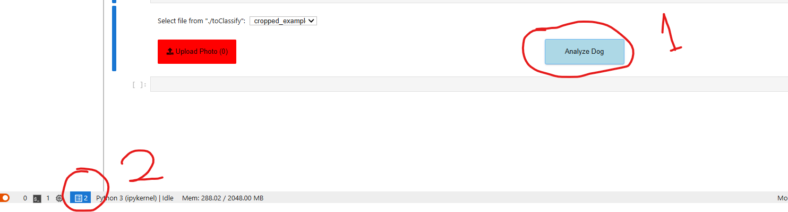

### Step 9

Expand the window by clicking and dragging the **thin bar** between the **log
tab** and the **cell view**. Once expanded, you can see the photo you've
uploaded and the predicted label for the given photo underneath.

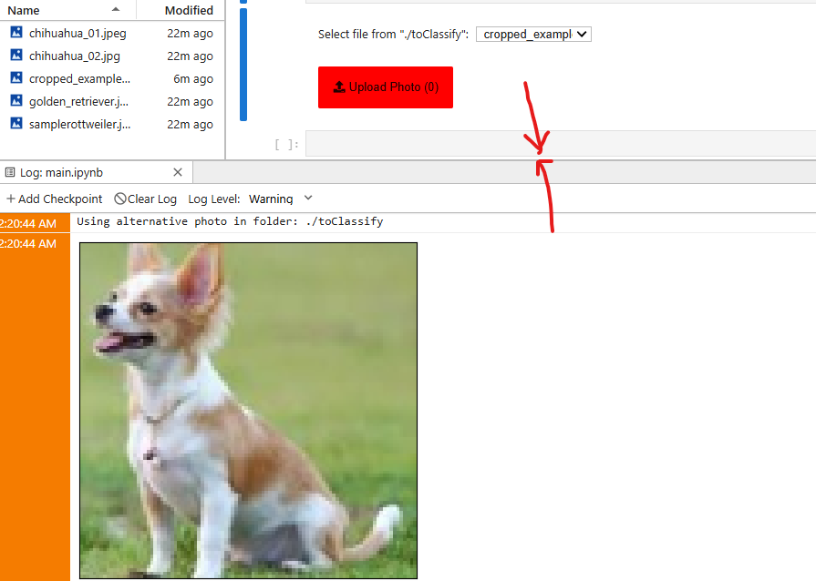
